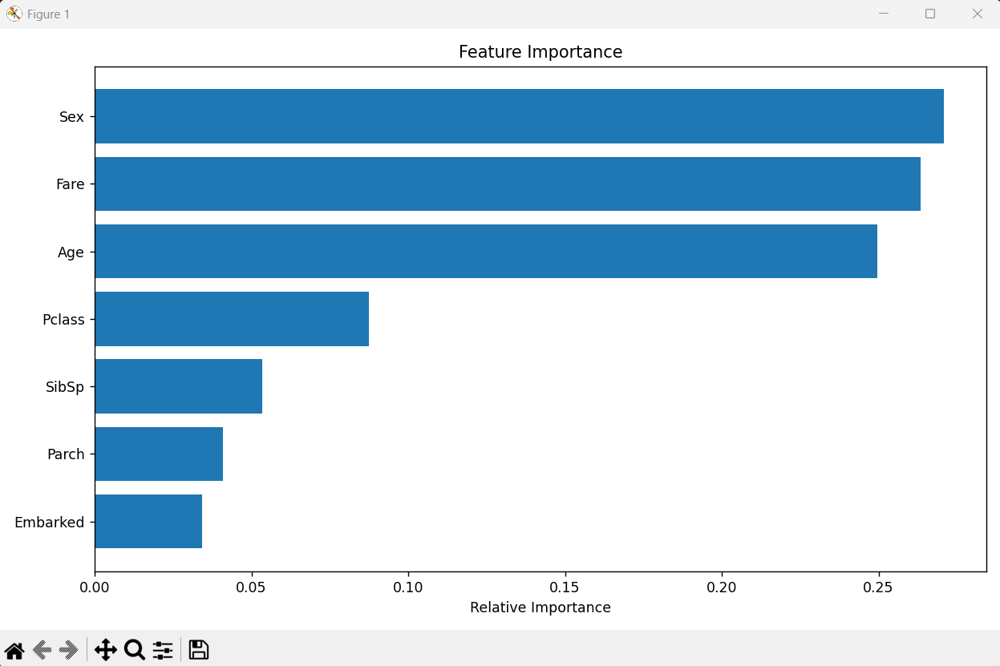

# Task 1 - Titanic Survival Prediction 🚢

## 📌 Objective
To build a machine learning model that predicts whether a passenger survived the Titanic disaster based on features like age, sex, ticket class, fare, etc.

## 📊 Dataset
- Source: [Kaggle Titanic Dataset](https://www.kaggle.com/datasets/yasserh/titanic-dataset)
- File used: `Titanic-Dataset.csv`

## 🔧 Tools & Libraries
- Python
- Pandas, NumPy
- Scikit-learn
- Matplotlib, Seaborn

## 🧠 Approach
- Data Cleaning: Filled missing values, dropped irrelevant columns
- Label Encoding: Converted `Sex` and `Embarked` to numeric
- Feature Selection: Removed PassengerId, Ticket, and Name
- Model Used: Random Forest Classifier
- Evaluation: Accuracy, Confusion Matrix, Classification Report
- Feature Importance Visualized

## 📈 Output
 

**Model Accuracy:** ~0.80 (may vary by run)

## 🎥 Demo Video
[Link to video] <!-- will upload later -->

## 🏁 Status
✅ Completed

> #codsoft #datascience #machinelearning #internship
