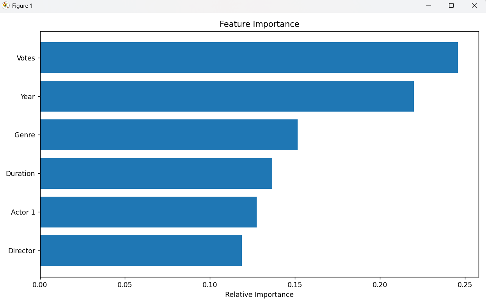

# Task 2 - Movie Rating Prediction 🎬

## 📌 Objective
To build a machine learning model that predicts IMDb ratings of Indian movies using various features such as votes, year, duration, genre, director, and actor.

## 📊 Dataset
- Source: [Kaggle - IMDb Indian Movies](https://www.kaggle.com/datasets/adrianmcmahon/imdb-india-movies)
- File Used: `IMDb Movies India.csv`

## 🧰 Tools & Libraries
- Python
- Pandas, NumPy
- Scikit-learn
- Matplotlib, Seaborn

## 🔧 Data Preprocessing
- Cleaned noisy columns (Votes, Duration, Year)
- Converted categorical columns (Genre, Director, Actor 1) into numerical using Label Encoding
- Handled missing values using forward-fill and drop strategies

## 🧠 Model Used
- **Random Forest Regressor**

## 🧪 Evaluation Metrics
- MAE (Mean Absolute Error)
- RMSE (Root Mean Squared Error)
- R² Score

## 📈 Feature Importance
The most influential features in predicting a movie's rating:

 <!-- optional: upload this file -->

## ✅ Status
Completed ✔️

---

> #codsoft #datascience #machinelearning #imdb #regression #python
