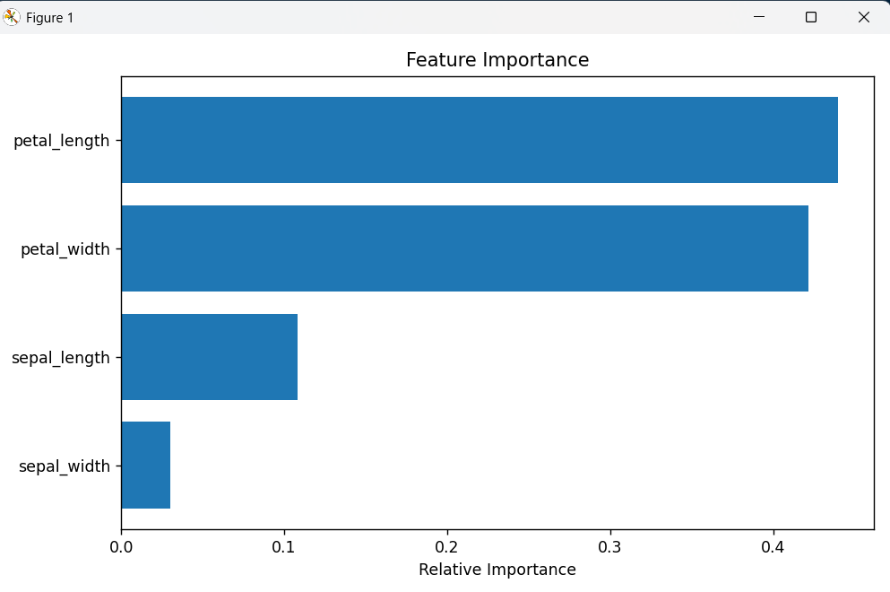

# Task 3 - Iris Flower Classification 🌸

## 📌 Objective
To build a classification model that can identify the species of an Iris flower based on its petal and sepal dimensions.

## 📊 Dataset
- Source: [Kaggle - Iris Dataset](https://www.kaggle.com/datasets/arshid/iris-flower-dataset)
- File used: `IRIS.csv`

## 🧰 Tools & Libraries
- Python
- Pandas, NumPy
- Scikit-learn
- Matplotlib, Seaborn

## 🔧 Preprocessing
- Renamed columns for readability
- Encoded the `species` column using LabelEncoder
- Splitted data into training and testing sets

## 🧠 Model Used
- **Random Forest Classifier**

## 🧪 Evaluation Metrics
- Accuracy
- Confusion Matrix
- Classification Report

## 📈 Feature Importance

The model found petal measurements to be the most important features:

## ✅ Status
Completed ✔️

---

> #codsoft #datascience #machinelearning #iris #classification #python
